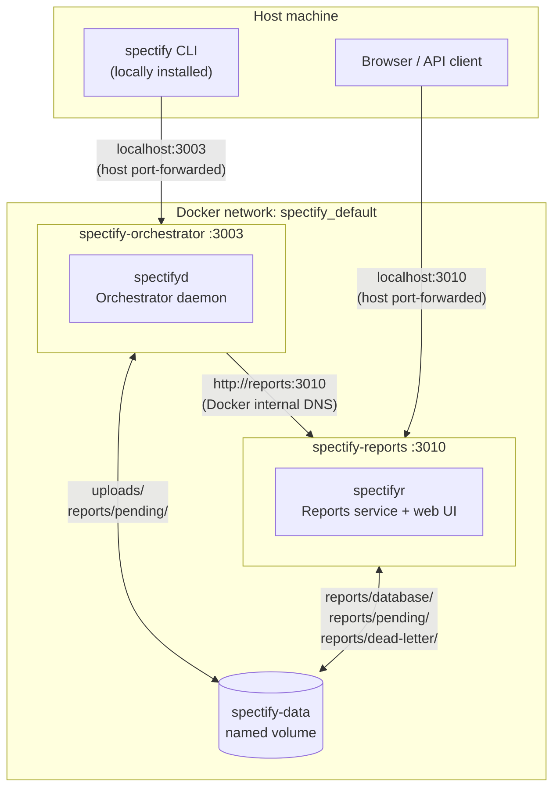

# Docker Architecture

This document describes the Docker setup for running the linting orchestrator in production:
the orchestrator daemon (`spectifyd`) alongside the reports service (`spectifyr`).

---

## Container layout



Both containers are built from the **same image** (`spectify:latest`).
The `command:` in `docker-compose.yml` selects which binary runs at start-up.

---

## Files

| File | Purpose |
|------|---------|
| `Dockerfile` | Multi-stage build for the full monorepo |
| `docker-compose.yml` | Service definitions, port mappings, shared volume |
| `.dockerignore` | Excludes `node_modules/`, `build/`, dev data, secrets |

---

## Single image, two processes

The monorepo produces three packages from one `npm run build`:

```
document-store  (library — no binary)
      ↓
   reports       (spectifyr binary)
      ↓
 orchestrator    (spectifyd + spectify binaries)
```

Because the orchestrator depends on both sibling packages (and all three share
`node_modules/` via npm workspaces), it is more practical to ship one image
that contains all three packages and override the start command per service,
rather than maintaining three separate images.

**Dockerfile stages:**

1. **`builder`** — Alpine + build toolchain (`python3 make g++ bash` for
   `better-sqlite3`). Installs all npm deps, installs ruleset-source deps,
   compiles TypeScript, then prunes dev deps.
2. **`runtime`** — Minimal Alpine. Copies compiled `build/` directories,
   `rulesets/`, and production `node_modules/` from the builder stage.
   Runs as a non-root `spectify` user.

---

## Shared volume: `spectify-data`

Both containers mount the same named volume at `/data/spectify`
(`SPECTIFY_HOME=/data/spectify`).

```
/data/spectify/
├── uploads/                   ← document store (written by spectifyd)
└── reports/
    ├── database/
    │   └── reports.db         ← SQLite database (read/written by spectifyr)
    ├── pending/               ← retry queue (written by spectifyd, consumed by spectifyr)
    └── dead-letter/           ← permanently-failed notifications (spectifyr)
```

The pending directory is the only path written by one service and read by the
other.  Using a shared volume avoids a network hop for that queue.

---

## Startup order

`spectifyd` (`depends_on: reports: condition: service_healthy`) waits until
`spectifyr` passes its health check before starting.  If you run `spectifyd`
alone without `spectifyr`, set:

```
SPECTIFYD_REPORTS_ENABLED=false
```

or leave it unset (reports integration is opt-in and disabled by default;
the docker-compose file explicitly enables it).

---

## API key

`spectifyd` authenticates to `spectifyr` with a shared secret:

| Variable | Service | Role |
|----------|---------|------|
| `SPECTIFYD_REPORTS_API_KEY` | orchestrator | sent as `Authorization: Bearer …` |
| `SPECTIFYR_API_KEY` | reports | validates incoming requests |

Both resolve to the same `SPECTIFY_API_KEY` host environment variable in
`docker-compose.yml`.

**Generate a key:**

```bash
export SPECTIFY_API_KEY=$(openssl rand -hex 32)
docker compose up -d
```

Store the key in a `.env` file (excluded from the image by `.dockerignore`) or
pass it via a secrets manager.

---

## CLI usage

### From the host (recommended)

Install the CLI once globally:

```bash
npm install -g @cisco-open/linting-orchestrator
```

The CLI defaults to standalone mode on port 3003, which maps directly to the
container:

```bash
spectify lint <document-id>
spectify health
spectify rulesets
```

> **Port note:** the CLI resolves `http://localhost:<port>` — it does not
> support a configurable host name.  Host port-forwarding (the default
> `"3003:3003"` in docker-compose.yml) is required for host-to-container
> access.  To change the mapped port, set `SPECTIFYD_PORT`:
>
> ```bash
> SPECTIFYD_PORT=4003 docker compose up -d
> spectify config set port.standalone 4003
> ```

### Inside the container (exec)

The orchestrator container already has the `spectify` CLI installed.  Use
`docker exec` to run it against the local daemon process:

```bash
docker exec spectify-orchestrator spectify lint <document-id>
docker exec spectify-orchestrator spectify rulesets
```

This is the simplest option for one-off commands in CI pipelines where the
CLI is not installed on the host.

### From another container on the same network

Join the `spectify_default` network and use host networking to reach the
orchestrator:

```bash
docker run --rm \
  --network spectify_default \
  --pid=host \
  spectify:latest \
  node packages/orchestrator/build/cli/index.js lint <document-id>
```

> Because `getApiUrl()` in the CLI hardcodes `localhost`, the only clean way
> to run the CLI from a different container is with host networking or via
> `docker exec`.  A future improvement would be to add a `SPECTIFYD_URL`
> environment variable to override the base URL entirely.

---

## Customisation

### Custom rulesets

Rulesets are bundled inside the image at build time (from
`packages/orchestrator/rulesets/`).  To use a custom or updated ruleset tree
without rebuilding:

```yaml
# docker-compose.yml override
services:
  orchestrator:
    volumes:
      - spectify-data:/data/spectify
      - ./my-rulesets:/app/packages/orchestrator/rulesets:ro
    environment:
      SPECTIFYD_RULESETS_DIR: /app/packages/orchestrator/rulesets
```

### Custom ports

```bash
SPECTIFYD_PORT=4003 SPECTIFYR_PORT=4010 docker compose up -d
```

### Persistent data on the host filesystem

Replace the named volume with a bind mount:

```yaml
volumes:
  spectify-data:
    driver: local
    driver_opts:
      type: none
      o: bind
      device: /opt/spectify/data
```

---

## Build and run commands

```bash
# First-time build
docker compose build

# Start both services (detached)
docker compose up -d

# Tail logs
docker compose logs -f

# Check health
docker compose ps
curl http://localhost:3003/health
curl http://localhost:3010/health

# Stop and remove containers (data volume is preserved)
docker compose down

# Remove containers AND the data volume (destructive)
docker compose down -v
```

---

## Upgrade workflow

```bash
# Pull latest source changes
git pull

# Rebuild image and restart with zero-downtime rolling update
docker compose build
docker compose up -d --no-deps --build orchestrator
docker compose up -d --no-deps --build reports
```

The SQLite database in the named volume survives container restarts and
upgrades.

---

## Security notes

- Containers run as the non-root `spectify` user (UID/GID assigned by Alpine).
- `SPECTIFY_API_KEY` is injected at runtime; it is never written into the
  image layer.
- The `.dockerignore` file excludes `.env`, `.env.*`, `node_modules/`, and
  all local dev data directories from the build context.
- For production, consider wrapping the API key with Docker Swarm secrets or
  Kubernetes secrets rather than environment variables.
