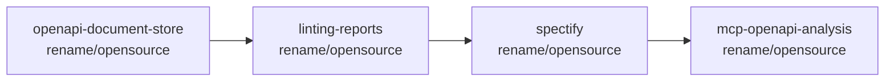

# Open-Sourcing Plan

Status: **Draft** · Owner: maintainers · Last updated: 2026-05-29

This document captures the agreed strategy for open-sourcing the four
repositories that make up the orchestrator linting tool family, including
renaming, repository layout, dev workflow, and rollout sequencing.

> **Scope:** repository renames, package renames, binary renames, env-var
> renames, doc/URL rewrites, README rewrites, and a coordinated branch +
> merge plan across all impacted repos. Functional behaviour is **not**
> changing.

---

## 1. Product naming model

A brand-free **repository / package** layer sits underneath a small,
cohesive **binary brand** (`spectify*`) that users actually type. This
gives us discoverability on GitHub/npm without sacrificing CLI UX.

In **explanatory prose** (READMEs, AGENTS files, design docs, release
notes, blog posts, error messages) we use descriptive product names; the
short identifiers appear only in **operational contexts** (shell
commands, configuration keys, package.json, env-var prefixes, on-disk
paths). This keeps the docs self-explanatory even out of context, while
keeping shell ergonomics short.

| Concept             | Identifier (CLI / binary / env / package)                                            | Prose name                                |
| ------------------- | ------------------------------------------------------------------------------------ | ----------------------------------------- |
| Orchestrator daemon | `spectifyd`, `SPECTIFYD_*`, `@cisco-open/linting-orchestrator`               | **the OpenAPI linting orchestrator**      |
| CLI                 | `spectify`, `SPECTIFY_*`                                                              | **the orchestrator CLI**                  |
| Reports service     | `spectifyr`, `SPECTIFYR_*`, `@cisco-open/linting-reports`                     | **the linting reporting service**         |
| Document store      | (library only — no binary), `@cisco-open/linting-document-store`                     | **the OpenAPI document store**            |

**Where `spectify*` is allowed in prose:**

- File/document chrome: top-level README headings (`# Spectify Reports`),
  HTML `<title>` tags, web UI page headers/footers, cleanup CLI banners.
  These are product chrome, not explanation.
- Migration / compatibility notes: "previously published as
  `spectify-reports`", `npm install` examples, env-var migration diffs.
- Source-file leading docblocks (`* Main entry point for Spectify Reports
  Service`) where they label the file by its product name.
- SARIF `tool.name` (kept as `Spectify` per decision #11).

**Where `spectify*` is forbidden in prose:**

- Body paragraphs describing what a component does or how components
  interact (use the descriptive name).
- Cross-references between components (“notifications from the
  orchestrator”, not “notifications from `spectifyd`” — the binary name
  is the _how_, not the _what_).

| Layer            | Name                                          | Rationale                                                                 |
| ---------------- | --------------------------------------------- | ------------------------------------------------------------------------- |
| Product family   | _OpenAPI Linting Orchestrator_ (descriptive)  | Discoverable, brand-free, describes what it does.                         |
| CLI binary       | `spectify`                                    | Already established; short; the user-facing entry point.                  |
| Daemon binary    | `spectifyd`                                   | Unix convention (`sshd`, `httpd`); mnemonic for "Spectify daemon".        |
| Reports binary   | `spectifyr`                                   | Sibling to `spectifyd`; reports DB lives under `~/.spectify/` already.    |
| User-facing line | _"Start the orchestrator with `spectifyd`, then use `spectify` to interact with it. Run `spectifyr` to expose the reports UI."_ | Single sentence onboarding. |

> The word _Spectify_ is intentionally retained **only** as the binary
> brand, as product chrome (web UI title, file headings), and as the
> SARIF `tool.name` (visible in IDEs/security UIs). It does **not**
> appear in repository names, npm package names, repository
> descriptions, or explanatory body prose.

---

## 2. Decisions table

| # | Topic                       | Decision                                                                                                                            | Notes |
|---|-----------------------------|-------------------------------------------------------------------------------------------------------------------------------------|-------|
| 1 | GitHub organization         | `github.com/cisco-open`                                                                                                              | All 4 repos move here. |
| 2 | Repo: orchestrator          | `spectify` (ships `spectify` CLI + `spectifyd` daemon)                                                          | One repo, two binaries. |
| 3 | Repo: reports               | `linting-reports` (ships `spectifyr` binary + client lib)                                                                    | Currently `spectify-reports/` submodule. |
| 4 | Repo: document store        | `openapi-document-store` (library only, no binary)                                                                                   | Currently `document-store/` submodule. |
| 5 | Repo: MCP consumer          | `mcp-openapi-analysis` (existing) — receives matching rename PR (env vars, URLs, client filename) | 4th coordinated repo. |
| 6 | npm scope                   | `@cisco-open/*` (assumed; may change before first publish — track in §10 notes)                                                      | Matches GitHub org for least surprise. |
| 7 | Package names               | `@cisco-open/linting-orchestrator`, `@cisco-open/linting-reports`, `@cisco-open/linting-document-store`              | All scoped. |
| 8 | Binary names                | `spectify`, `spectifyd`, `spectifyr`                                                                                                 | See §1. |
| 9 | Env-var prefixes            | `SPECTIFY_*` (CLI) · `SPECTIFYD_*` (daemon) · `SPECTIFYR_*` (reports)                                                                | Clean break: no `REPORT_SERVICE_*` aliases. |
| 10 | On-disk paths              | Keep `~/.spectify/` for all three components (including `~/.spectify/reports/database/reports.db`)                                   | Zero user-data migration. |
| 11 | SARIF `tool.name`          | `Spectify` (kept as brand)                                                                                                           | Per user choice. |
| 12 | Doc / repo URLs in code    | Update to `github.com/cisco-open/spectify/...`                                                                   | Includes `sarif-builder.ts` help URLs and any README links. |
| 13 | Local dev model            | **npm workspaces** with `packages/*` reorg (see §4)                                                                                  | All three packages move under `packages/`. |
| 14 | Submodule → publish path   | Hybrid: workspaces now; publish to npm at v1.0; consumers switch from workspace-link to versioned dep at that point.                 | |
| 15 | Backward-compat aliases    | **None** — clean break (pre-1.0, no public users)                                                                                    | Simplifies all four repos. |
| 16 | Branch name                | `rename/opensource` in each of the 4 repos                                                                                           | One PR per repo. |
| 17 | License                    | Apache-2.0 across all 4 repos (reports currently MIT → relicensed)                                                                   | Harmonized. |
| 18 | Initial version at rename  | `<next-major>.0.0-rc.1` on each renamed package (continues each package's existing version line; major bump signals the breaking rename) | document-store: `3.0.0-rc.1` (was 2.3.0). reports: `1.0.0-rc.1` (was 0.5.2 \u2014 cut to 1.0 for public API). orchestrator: TBD. |
| 19 | MCP client filename        | `mcp-openapi-analysis/src/spectify-client.ts` → `orchestrator-client.ts`                                                             | Matches brand-free family naming. |
| 20 | Prose vs identifier split  | Explanatory prose uses descriptive names (“the OpenAPI linting orchestrator”, “the linting reporting service”, “the OpenAPI document store”). `spectify*` strings appear only in shell commands, configuration, package.json, env-var prefixes, on-disk paths, file/UI chrome, and SARIF `tool.name`. | See §1 for full allow/forbid lists. |

---

## 3. Impacted surface (inventory)

Approximate counts from a `grep -ril spectify` across the spectify repo
(excluding `node_modules` and `build/`): **~142 files**. Plus 4 files in
`document-store/`, all of `spectify-reports/`, and the MCP consumer.

### 3.1 Files / identifiers that **must** change

| Category                | Locations                                                                                       |
|-------------------------|-------------------------------------------------------------------------------------------------|
| `package.json` `name`   | Root, `document-store/`, `spectify-reports/`                                                    |
| `package.json` `bin`    | Root — `spectify` (keep), `spectify-server` → `spectifyd`; reports — add `spectifyr` bin        |
| `package.json` deps     | Root depends on `spectify-reports` (`file:./spectify-reports`) → workspace ref                  |
| Submodule paths         | `document-store/`, `spectify-reports/` become workspace packages (see §4)                       |
| Repository URLs         | `package.json` `repository`, `homepage`, `bugs`; all README links; SARIF help URLs              |
| `src/formatters/sarif-builder.ts` | `informationUri` and help URL templates (lines ~62, 126, 130)                          |
| `src/cli/commands/start.ts` (and siblings) | Any binary self-references                                                            |
| Env vars                | `src/config.ts`, `src/cli/config-manager.ts`, reports `src/index.ts`, MCP `src/config.ts`       |
| Scripts                 | `scripts/*.sh` references to `spectify-reports/`, `document-store/`, etc.                       |
| Tests                   | Integration tests that spawn binaries or read `~/.spectify/` paths                              |
| Docs                    | All of `docs/`, `README.md`, `AGENTS.md`, `.github/copilot-instructions.md`                     |

### 3.2 Files / identifiers that **must NOT** change

- `~/.spectify/` data directory layout
- SARIF `tool.name = "Spectify"`
- CLI binary name `spectify`
- Ruleset IDs, ruleset config schema, HTTP API endpoints/payloads
- `rulesets/` directory layout

---

## 4. Local dev: npm workspaces + `packages/*` reorg

We replace the current `git submodule` + `file:` dependency setup with
**npm workspaces**, and move all three packages under a `packages/`
directory. The repo root becomes a thin private workspace manifest; the
orchestrator code (currently at the root) becomes one workspace member
among three.

Reason for doing the folder move now (not as a follow-up): npm
workspaces require each member to live in its own directory — the
repo root itself cannot be a publishable workspace member. Deferring
the move would force a second massive churn PR later. Doing it inside
the rename branch concentrates the disruption to one moment.

### 4.1 Target workspace layout

```
spectify/        # repo root (umbrella)
├── package.json                     # "private": true, workspaces: ["packages/*"]
├── packages/
│   ├── orchestrator/                # moved from repo root (src/, tests/, etc.)
│   │   └── package.json             # name: @cisco-open/linting-orchestrator
│   ├── reports/                     # moved from spectify-reports/
│   │   └── package.json             # name: @cisco-open/linting-reports
│   └── document-store/              # moved from document-store/
│       └── package.json             # name: @cisco-open/linting-document-store
├── rulesets/                        # stays at root (shared config-like asset)
├── docs/
├── scripts/
├── README.md
├── AGENTS.md
├── CONTRIBUTING.md, CODE_OF_CONDUCT.md, SECURITY.md, MAINTAINERS.md, LICENSE
└── .github/
```

### 4.2 Git history preservation

Use `git mv` (not delete + add) for every moved file. Per-file blame
is preserved and `git log --follow <path>` continues to work. The
tradeoff: directory-level `git log packages/orchestrator/src/` won't
show history from before the move. This is acceptable.

Any active branches/PRs in the spectify repo must be rebased after the
move. Coordinate the rename PR so it lands when the branch is quiet.

### 4.3 Migration mechanics

1. **Subrepo prep.** In each of `document-store/` and `spectify-reports/`,
   tag the current `main` HEAD (e.g., `pre-rename-snapshot`) so the
   independent histories remain easy to reach after de-submoduling.
2. **De-submodule.** In the orchestrator repo: `git submodule deinit`
   both, remove from `.gitmodules`, then `git rm --cached` the
   submodule gitlinks. Re-add the directory contents as regular files.
3. **Move packages.** `git mv` each into `packages/<name>/`:
   - root `src/`, `tests/`, `tsconfig.json`, etc. → `packages/orchestrator/`
   - `spectify-reports/*` → `packages/reports/`
   - `document-store/*` → `packages/document-store/`
4. **Root `package.json`.** Replace the orchestrator's metadata with
   a workspace manifest:
   ```json
   {
     "name": "spectify-monorepo",
     "private": true,
     "workspaces": ["packages/*"],
     "scripts": {
       "build": "npm run build --workspaces --if-present",
       "test":  "npm run test  --workspaces --if-present",
       "dev":   "npm run dev   --workspace=@cisco-open/linting-orchestrator"
     }
   }
   ```
5. **Per-package `package.json`.** Each `packages/*/package.json` gets
   the new scoped name, version `1.0.0-rc.1`, and Apache-2.0 license.
6. **Cross-package deps.** Use the workspace protocol:
   ```json
   "@cisco-open/linting-reports":  "workspace:*",
   "@cisco-open/linting-document-store":   "workspace:*"
   ```
   Replaces the current `file:./spectify-reports` and the relative
   `../document-store/build/*` imports.
7. **Imports.** Find/replace `../document-store/build/...` →
   `@cisco-open/linting-document-store/...` in orchestrator and reports.
8. **Scripts.** `scripts/check-submodules.sh` is deleted. `npm run
   build:all` becomes redundant (workspaces handle it).
9. **`tsconfig.json`.** Per-package `tsconfig.json` continues to compile
   locally. Optionally add a root `tsconfig.json` with project
   references for incremental builds — defer to follow-up.
10. **CI.** Update workflows to run `npm ci && npm test` at root; npm
    workspaces handles install + cross-linking.

### 4.4 Path to npm publish (post-rename, separate effort)

At v1.0 cutover:

- Optionally split each `packages/*` back into its own public repo
  under `github.com/cisco-open/<repo>`. (Or keep the monorepo and
  publish from it — decide at cutover based on contribution patterns.)
- Publish each package to npm under `@cisco-open/*` (confirm scope
  ownership before publishing).
- Orchestrator and reports switch from `workspace:*` to versioned
  `^1.0.0` deps when consumed outside the monorepo.
- Document store and reports become independently versioned and
  released.

---

## 5. Per-repo task checklist

All four repos use branch name **`rename/opensource`**.

> **Note on PR ordering:** because we're moving to a monorepo with
> `packages/*`, the three sub-package PRs are actually applied inside
> a single coordinated PR on the orchestrator repo's `rename/opensource`
> branch (after de-submoduling). The sub-repos still get their own
> `rename/opensource` branch first — these capture each subrepo's
> independent history at the renamed/relicensed state — and are then
> merged into the monorepo via the de-submodule step.

### 5.1 `openapi-document-store` (currently `document-store/` submodule)

- [ ] Rename `package.json` `name` → `@cisco-open/linting-document-store`, version `1.0.0-rc.1`
- [ ] Relicense to Apache-2.0 (was already Apache-2.0? confirm; replace `LICENSE` if needed)
- [ ] Update `README.md`, `AGENTS.md`, `CHANGELOG.md` to remove all `spectify` mentions (library is brand-free)
- [ ] Update `repository` / `homepage` / `bugs` URLs to `github.com/cisco-open/openapi-document-store`
- [ ] Update any `description` text mentioning Spectify or MCP
- [ ] Verify no imports leak the brand
- [ ] Tag pre-rename HEAD as `pre-rename-snapshot`
- [ ] PR opened, reviewed, merged **first** (no upstream dependencies)

### 5.2 `linting-reports` (currently `spectify-reports/` submodule)

- [ ] Rename `package.json` `name` → `@cisco-open/linting-reports`, version `1.0.0-rc.1`
- [ ] Add `bin: { "spectifyr": "build/cli.js" }` (create thin CLI entry if not present)
- [ ] Relicense from MIT to Apache-2.0; replace `LICENSE` file; update `package.json` `license` field; add a CHANGELOG note about the relicense
- [ ] Update env-var prefixes: `REPORT_SERVICE_*` → `SPECTIFYR_*` (keep DB path `~/.spectify/reports/database/reports.db`)
- [ ] Update `npm start` script to use `SPECTIFYR_DB_PATH`
- [ ] Update `README.md`, `AGENTS.md`, `CHANGELOG.md`
- [ ] Update `repository` / `homepage` / `bugs` URLs to `github.com/cisco-open/linting-reports`
- [ ] Update document-store dependency to `@cisco-open/linting-document-store`
- [ ] Tag pre-rename HEAD as `pre-rename-snapshot`
- [ ] PR opened **after** document-store PR is merged

### 5.3 `spectify` (currently this repo, `spectify/`)

- [ ] Reorganize into `packages/*` layout (see §4)
- [ ] Add root workspace manifest `package.json`
- [ ] Rename `packages/orchestrator/package.json` `name` → `@cisco-open/linting-orchestrator`, version `1.0.0-rc.1`
- [ ] Update `bin`: keep `spectify`; rename `spectify-server` → `spectifyd`
- [ ] Update `spectify.components` block: rename `server` → `daemon`
- [ ] Update version scheme: keep `{daemon}-cli{cli}` format, document in [`docs/VERSIONING_STRATEGY.md`](docs/VERSIONING_STRATEGY.md)
- [ ] Update root `description`, `keywords`, `repository`, `homepage`, `bugs`
- [ ] Update reports dep from `file:./spectify-reports` → `"@cisco-open/linting-reports": "workspace:*"`
- [ ] Update document-store imports from `../document-store/build/*` → `@cisco-open/linting-document-store`
- [ ] Update env vars in `src/config.ts`: split into `SPECTIFY_*` (CLI) and `SPECTIFYD_*` (daemon)
- [ ] Update `src/formatters/sarif-builder.ts`:
  - Keep `tool.name = 'Spectify'`
  - Replace `informationUri` and help URLs with `github.com/cisco-open/spectify/...`
- [ ] Update CLI help text and banners to reflect the "spectify/spectifyd/spectifyr" model
- [ ] Update `src/cli/commands/start.ts` (and any sibling) to refer to `spectifyd`
- [ ] Rewrite `README.md` per outline in §6
- [ ] Update `AGENTS.md`, `.github/copilot-instructions.md`
- [ ] Update `docs/*.md`:
  - [`docs/DEPLOYMENT_MODES_AND_PORTS.md`](docs/DEPLOYMENT_MODES_AND_PORTS.md)
  - [`docs/INSTALLATION_GUIDE.md`](docs/INSTALLATION_GUIDE.md)
  - [`docs/QUICK_START_API.md`](docs/QUICK_START_API.md)
  - [`docs/QUICK_START_CLI.md`](docs/QUICK_START_CLI.md)
  - [`docs/PORT_AND_MODE_QUICK_REF.md`](docs/PORT_AND_MODE_QUICK_REF.md)
  - [`docs/RULESET_MANAGEMENT.md`](docs/RULESET_MANAGEMENT.md)
  - [`docs/STARTUP_ORDER.md`](docs/STARTUP_ORDER.md)
  - [`docs/SPECTIFY_MCP_INTEGRATION_ARCHITECTURE.md`](docs/SPECTIFY_MCP_INTEGRATION_ARCHITECTURE.md) → rename file
  - [`docs/REPORT_SERVICE_INTEGRATION_QA.md`](docs/REPORT_SERVICE_INTEGRATION_QA.md)
- [ ] Update `scripts/*.sh` paths and messages
- [ ] Update tests under `tests/` to use new binary names where they spawn processes
- [ ] Update `examples/config.yaml`, `examples/start-with-mcp.sh`
- [ ] Update `SECURITY.md`, `CONTRIBUTING.md`, `MAINTAINERS.md`, `CODE_OF_CONDUCT.md`
- [ ] Convert root to npm workspace declaration (see §4)
- [ ] Run full test suite (`npm test`) + manual smoke: `spectifyd` boots, `spectify lint` works against it, `spectifyr` serves reports
- [ ] PR opened **after** reports PR is merged

### 5.4 `mcp-openapi-analysis`

- [ ] Update env vars targeting the daemon: `SPECTIFY_*` → `SPECTIFYD_*`
- [ ] Rename `src/spectify-client.ts` → `src/orchestrator-client.ts` (and update class names + imports)
- [ ] Update doc references and integration docs (`docs/SPECTIFY_*` filenames)
- [ ] Update repo URLs pointing at old `DevNet/spectify` → `cisco-open/spectify`
- [ ] Update GitHub "About" description (see §6.1)
- [ ] PR opened in parallel with orchestrator PR; merged after orchestrator merges

---

## 6. GitHub repo metadata

### 6.1 "About" descriptions

GitHub limits the "About" field to 350 characters.

| Repo | Description |
|------|-------------|
| `spectify` | Quality assurance for OpenAPI documents. An orchestrator daemon (`spectifyd`) and CLI (`spectify`) that run Spectral and custom rule engines at scale, with worker-per-ruleset architecture, document caching, and pluggable storage. |
| `linting-reports` | Persistent storage and web UI for OpenAPI lint results. Companion service (`spectifyr`) to the OpenAPI Linting Orchestrator — track lint runs over time, browse issues, and share results across teams. |
| `openapi-document-store` | Pluggable document storage library for OpenAPI documents. Provides a common adapter interface with local filesystem and MCP-backed implementations, shared across the OpenAPI linting toolchain. |
| `mcp-openapi-analysis` | Model Context Protocol (MCP) server for OpenAPI document analysis. Manages document uploads and exposes inspection tools to AI agents; integrates with the OpenAPI Linting Orchestrator for linting. |

### 6.2 Topics (suggested)

- `spectify`: `openapi` `spectral` `linting` `api-quality` `microservice` `nodejs` `typescript`
- `linting-reports`: `openapi` `linting` `reports` `sqlite` `nodejs` `typescript`
- `openapi-document-store`: `openapi` `storage` `adapter` `library` `typescript`
- `mcp-openapi-analysis`: `openapi` `mcp` `model-context-protocol` `ai-agents` `typescript`

## 7. Public README rewrite outline

Target audience: external open-source users discovering the repo.

```
# Linting Orchestrator

> Quality assurance for API specifications — orchestrated linting with
> Spectral and custom rule engines.

## What's in this repo
- spectifyd  — the orchestrator daemon (HTTP API, worker pool)
- spectify   — the CLI used to talk to the daemon (or run embedded)
- spectifyr  — the reports service (persistent storage + web UI)

## Quick start
  npm install -g @<scope>/spectify
  spectifyd &                          # start the daemon
  spectify lint path/to/openapi.yaml   # lint a document
  spectifyr &                          # optional: browse reports at :3004

## How it fits together
[architecture diagram: spectify → spectifyd → workers → spectifyr]

## Deployment modes
(short table; deep-link to docs/DEPLOYMENT_MODES_AND_PORTS.md)

## Rulesets
(short blurb; deep-link to docs/RULESET_MANAGEMENT.md)

## Contributing
(deep-link to CONTRIBUTING.md, CODE_OF_CONDUCT.md, SECURITY.md, MAINTAINERS.md)

## License
Apache-2.0
```

Sibling repos (`linting-reports`, `openapi-document-store`,
`mcp-openapi-analysis`) get a similarly trimmed README focused on the
single package's job, with cross-links back to the umbrella.

---

## 8. Migration guide (for internal users)

Place this in `docs/MIGRATION_TO_OPENSOURCE.md` (separate follow-up file)
or as a section in each repo's `CHANGELOG.md`.

### 8.1 What you have to change

| Before                                                  | After                                                          |
|---------------------------------------------------------|----------------------------------------------------------------|
| `npm install -g spectify`                               | `npm install -g @cisco-open/linting-orchestrator`      |
| `spectify-server` command                               | `spectifyd`                                                    |
| `SPECTIFY_PORT`, `SPECTIFY_*` (daemon-scoped)           | `SPECTIFYD_PORT`, `SPECTIFYD_*`                                |
| `REPORT_SERVICE_DB_PATH`                                | `SPECTIFYR_DB_PATH`                                            |
| `git clone .../spectify`                                | `git clone github.com/cisco-open/spectify` |
| `import ... from '../document-store/build/...'`         | `import ... from '@cisco-open/linting-document-store'`         |

### 8.2 What stays the same

- `spectify` CLI command (name, flags, output)
- `~/.spectify/` data directory and all files within
- All HTTP API endpoints, request/response shapes
- All ruleset IDs and `rulesets.yaml` schema
- SARIF output structure (only the help URLs change)
- Config file format

### 8.3 No data migration

On-disk state (config, history, reports DB) is fully forward-compatible
because `~/.spectify/` is preserved.

---

## 9. Rollout sequence

Strict dependency order. Each step waits on the previous one's PR to
merge into `main` of its repo.



1. **document-store** PR — smallest blast radius, no consumers in this set yet that block.
2. **reports** PR — depends on document-store package name being final.
3. **orchestrator** PR — depends on both above; largest PR (most files).
4. **mcp-openapi-analysis** PR — consumer, updated last.

After all four merge:
- Move repos to `github.com/cisco-open/*` (admin action).
- Set old repo to archived/redirect.
- Open follow-up issues for: npm publish, folder reorg into
  `packages/*`, license harmonization, README polish.

---

## 10. Risks & mitigations

| Risk                                                                      | Mitigation                                                                                |
|---------------------------------------------------------------------------|-------------------------------------------------------------------------------------------|
| Massive diff makes review hard                                            | One PR per repo; within the orchestrator PR, group commits: (1) package metadata, (2) env vars, (3) code identifiers, (4) docs. |
| Submodule de-linking loses history                                        | Tag each subrepo at the pre-rename commit; the subrepos continue to exist independently.   |
| Workspaces convert from monolith breaks builds                            | Land workspace conversion in a separate prep commit before identifier renames.            |
| `mcp-openapi-analysis` consumers break on env-var renames                 | Clean-break is acceptable per decision #15; call it out in MCP CHANGELOG.                  |
| `spectifyd`/`spectifyr` collide with another tool on user `$PATH`         | Quick check on common Linux/Mac distros; collision is unlikely; documented in README.     |
| npm package names already taken                                           | We're using scoped packages (`@<scope>/...`), so this can't happen.                        |
| Repo URL changes break external bookmarks                                 | GitHub auto-redirects from the old `DevNet/spectify` for ≥1 year.                          |
| Tests reference `spectify-server` command                                 | Catch via full `npm test` run on orchestrator PR before merge.                             |
| `~/.spectify/` retention conflicts with brand-free messaging              | Acceptable — `spectify` remains the user-typed CLI brand; path matches that.              |

---

## 11. Notes & deferred items

All initial open decisions have been resolved (see §2 rows 6, 13, 17,
18, 19, and §6.1). Items to revisit later:

1. **npm scope confirmation.** We've assumed `@cisco-open/*`. Verify
   scope ownership and that the org agrees before the first publish.
   If the scope changes, it's a global find/replace across the
   monorepo and the MCP consumer.
2. **Splitting the monorepo at publish time.** Decide at v1.0 cutover
   whether to keep the monorepo (simpler) or split into three public
   repos (more conventional for independent packages). Driven by
   contribution patterns.
3. **TypeScript project references.** Optional root `tsconfig.json`
   with project references for incremental builds across workspaces.
   Deferred — current per-package `tsc` works.
4. **CI rework.** GitHub Actions workflows will need a small refactor
   to run at the monorepo root. Scope: separate follow-up PR after
   the rename lands.
5. **Repo redirects.** GitHub auto-redirects from `DevNet/spectify`
   for ≥1 year. After the rename, archive the old repo with a pinned
   README pointing to the new location.

---

## 12. References

- [`AGENTS.md`](../AGENTS.md) — current architecture and conventions
- [`docs/DEPLOYMENT_MODES_AND_PORTS.md`](DEPLOYMENT_MODES_AND_PORTS.md) — runtime model unchanged by this work
- [`docs/VERSIONING_STRATEGY.md`](VERSIONING_STRATEGY.md) — to be updated to reflect `daemon` (was `server`) component name
- [`docs/INSTALLATION_GUIDE.md`](INSTALLATION_GUIDE.md) — will need full rewrite for new package/binary names
- [`docs/SPECTIFY_MCP_INTEGRATION_ARCHITECTURE.md`](SPECTIFY_MCP_INTEGRATION_ARCHITECTURE.md) — rename file; update env vars and URLs
